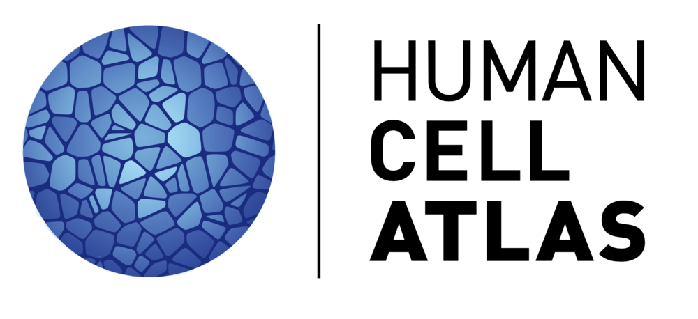

<p align="center">
        
</p>

## :dna: Overview

This repository contains a set of command-line utilities, written in Python, that are used in the Human Cell Atlas adapter pipelines. 

### What do these tools do?

The Human Cell Atlas is an international collaborative consortium that charts the cell types in the healthy body. Through collaboration with the Broad Institute, researchers are able to leverage
the Broad's [WARP pipelines](https://broadinstitute.github.io/warp/) to process the genomic data needed for the Human Cell Atlas project.

These adapter tools transform the data produced by the WARP pipelines ([Optimus](https://broadinstitute.github.io/warp/docs/Pipelines/Optimus_Pipeline/README) & [Smart-seq2 Multi-Sample](https://broadinstitute.github.io/warp/docs/Pipelines/Smart-seq2_Multi_Sample_Pipeline/README)) to the desired specifications required by data importers from the Human Cell Atlas project.

For full docs on the schema that the adapter-tools adhere to please see [here](https://github.com/HumanCellAtlas/dcp2/blob/main/docs/dcp2_system_design.rst).

## :gear: Getting started

We recommend setting up a virtual environment when working with the adapter-tools. 

It is also suggested to enable linting via _flake8_ to conform with our style guide. There are pre-commit hooks that will run _flake8_ and _black_ to auto format your code.

```bash
$ virtualenv venv
$ source venv/bin/activate

$ pip install -r requirements.txt

$ pip install -e .
$ pre-commit install 
```

## :white_check_mark: Running Tests

This repo comes with some simple sanity-check unit tests to ensure that the critical functionality of the adapters is running as expected.

```bash
$ pytest -v
```

If functionality of the adapters changes or there are schema updates then please update the truth set for the specified test which will be found in `adapter_tools/tests/*/*/*_expected.json`

**A test run in Terra should still be executed to ensure end-to-end functionality.**

## :boom: Troubleshooting
If you have any questions about this tool or need some help configuring it please reach out at [dsde-engineer@broadinstitute.org](dsde-engineer@broadinstitute.org).
